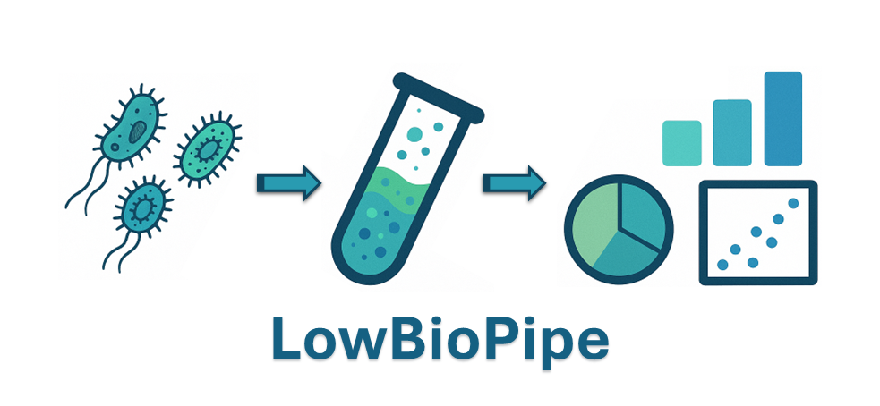

# LowBioPipe

<div align="center">



**A Nextflow wrapper for statistical analysis of low biomass microbiome data**

[](https://www.nextflow.io/)
[](LICENSE)
[](VERSION)

</div>

## Overview

LowBioPipe is a Nextflow-based computational framework that serves as a wrapper for processing outputs from the [nf-core/taxprofiler](https://nf-co.re/taxprofiler) pipeline, specifically designed for downstream analysis of low-biomass microbiome samples. In addition to facilitating data processing, LowBioPipe implements comprehensive statistical analyses, data-mining, and data visualization techniques, including contaminant filtering, multi-rank taxonomic abundance profiling, and diversity metrics with graphical representations.

## Pipeline Summary

1. **Contaminant Filtering** - Remove reads assigned to specified taxa from [Kraken2](https://github.com/DerrickWood/kraken2) output
2. **[Recentrifuge](https://github.com/khyox/recentrifuge) Analysis** - Refined taxonomic profiling with negative control integration
3. **Abundance Tables** - Generate taxa × samples matrices at species, genus, and phylum levels
4. **Diversity Analysis** - Alpha/beta diversity, PCoA ordination, clustering heatmaps, PERMANOVA

## Requirements

- Nextflow ≥ 23.04.0
- Docker, Singularity, or Conda
- [NCBI taxdump](https://ftp.ncbi.nlm.nih.gov/pub/taxonomy/taxdump.tar.gz)

### Input: nf-core/taxprofiler Output

LowBioPipe requires output from nf-core/taxprofiler with Kraken2 per-read classifications:

```bash
nextflow run nf-core/taxprofiler \
    -profile docker \
    --input samplesheet.csv \
    --databases databases.csv \
    --outdir taxprofiler_results \
    --run_kraken2 \
    --kraken2_save_readclassifications
```

The `--kraken2_save_readclassifications` flag is required.

## Installation

Clone the repository and run the installation script:

```bash
git clone https://github.com/Physics4MedicineLab/LowBioPipe.git
cd LowBioPipe
./install.sh
```

### Conda Environment

Alternatively, create a conda environment with all dependencies:

```bash
conda env create -f environment.yml
conda activate lowbiopipe
```

## Usage

```bash
nextflow run main.nf \
    --taxprofiler_results /path/to/taxprofiler/output \
    --kraken2_db_name <database_name> \
    --samples S1,S2,S3,S4 \
    --controls BLANK1,BLANK2 \
    -profile docker
```

For PERMANOVA statistical testing, provide a groups file:

```bash
nextflow run main.nf \
    --taxprofiler_results /path/to/taxprofiler/output \
    --kraken2_db_name <database_name> \
    --samples S1,S2,S3,S4 \
    --controls BLANK1,BLANK2 \
    --groups_file groups.tsv \
    -profile docker
```

## Parameters

### Required

| Parameter | Description |
|-----------|-------------|
| `--taxprofiler_results` | Path to taxprofiler output directory |
| `--kraken2_db_name` | Kraken2 database name used in taxprofiler |

### Sample Configuration

| Parameter | Description | Default |
|-----------|-------------|---------|
| `--samples` | Sample IDs (comma-separated) | `[]` |
| `--controls` | Negative control IDs (comma-separated) | `[]` |
| `--groups_file` | Sample-to-group mapping for PERMANOVA | `null` |

### Reference Data

| Parameter | Description | Default |
|-----------|-------------|---------|
| `--taxdump` | NCBI taxdump directory | `data/taxdump` |
| `--exclude_taxa` | Contaminant TaxID file | `config/contaminants_example.txt` |

### Contaminant Filtering

| Parameter | Description | Default |
|-----------|-------------|---------|
| `--filter_include_ancestors` | Also filter ancestor taxa (walking up to root) | `false` |
| `--filter_include_descendants` | Also filter descendant taxa (walking down tree) | `false` |

### Recentrifuge

| Parameter | Description | Default |
|-----------|-------------|---------|
| `--recentrifuge_min_score` | Minimum score threshold | `10` |

### Abundance Tables

| Parameter | Description | Default |
|-----------|-------------|---------|
| `--abundance_ranks` | Taxonomic ranks to generate | `['species','genus','phylum']` |
| `--abundance_aggregate` | Aggregate taxa to specified rank | `true` |
| `--abundance_min_count` | Minimum total count threshold | `1` |
| `--abundance_min_samples` | Minimum samples threshold | `2` |
| `--abundance_relative` | Generate relative abundance tables | `true` |
| `--abundance_keep_unranked` | Keep taxa without resolvable rank | `false` |

### Output

| Parameter | Description | Default |
|-----------|-------------|---------|
| `--outdir` | Output directory | `results` |

## Output

```
results/
├── filtered_reads/          # Filtered Kraken2 classifications
├── recentrifuge/            # Recentrifuge reports (.html, .xlsx)
├── abundance/               # Count matrices and metadata
│   ├── *_counts_*.tsv
│   ├── *_relative_*.tsv
│   └── *_taxa_metadata_*.tsv
└── diversity/
    └── {species,genus,phylum}/
        ├── alpha_metrics_*.tsv           # Alpha diversity (observed OTUs, Shannon, Simpson, Chao1)
        ├── alpha_*_boxplot_*.png         # Alpha diversity boxplots
        ├── alpha_*_violin_*.png          # Alpha diversity violin plots
        ├── beta_braycurtis_*.tsv         # Bray-Curtis distance matrix
        ├── beta_jaccard_*.tsv            # Jaccard distance matrix
        ├── beta_aitchison_*.tsv          # Aitchison distance matrix (CLR-Euclidean)
        ├── pcoa_braycurtis_coords_*.tsv  # PCoA coordinates (Bray-Curtis)
        ├── pcoa_jaccard_coords_*.tsv     # PCoA coordinates (Jaccard)
        ├── pcoa_aitchison_coords_*.tsv   # PCoA coordinates (Aitchison)
        ├── pcoa_braycurtis_*.png         # PCoA plot (Bray-Curtis)
        ├── pcoa_jaccard_*.png            # PCoA plot (Jaccard)
        ├── pcoa_aitchison_*.png          # PCoA plot (Aitchison)
        ├── heatmap_*.png                 # Hierarchical clustering heatmap
        ├── permanova_braycurtis_*.txt    # PERMANOVA results (Bray-Curtis)
        └── permanova_aitchison_*.txt     # PERMANOVA results (Aitchison)
```

## Input File Formats

**Contaminant file** - One TaxID per line:
```
9606        # Homo sapiens
1751056     # Flavobacterium ammonificans
```

**Groups file** - Tab-separated, no header:
```
sample1    group_A
sample2    group_A
sample3    group_B
sample4    group_B
```

## Citation

If you use LowBioPipe, please cite:

```bibtex

```

Please also cite the underlying tools:

- **nf-core/taxprofiler**: Stamouli et al. (2023) [doi:10.1101/2023.10.20.563221](https://doi.org/10.1101/2023.10.20.563221)
- **Recentrifuge**: Martí (2019) [doi:10.1371/journal.pcbi.1006967](https://doi.org/10.1371/journal.pcbi.1006967)
- **Kraken2**: Wood et al. (2019) [doi:10.1186/s13059-019-1891-0](https://doi.org/10.1186/s13059-019-1891-0)

## License

MIT License. See [LICENSE](LICENSE) for details.
